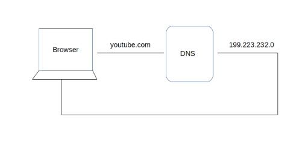
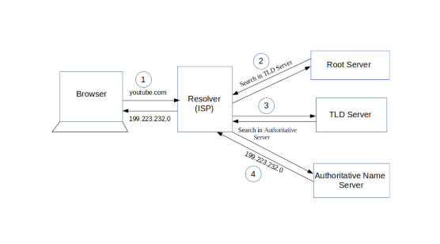
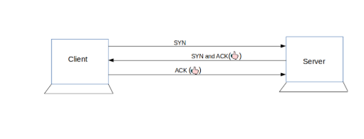

# The Life of a Packet: A Journey Through the Internet

## Overview
This section demonstrates what happens behind the scenes when you visit a website, using YouTube as an example. We'll explore the fascinating journey of how your request travels through the internet to bring you the content you want. Every time you enter a URL in your browser, a complex series of events occurs in milliseconds to deliver the webpage to your screen.

## The Journey of a Packet

### 1. DNS Resolution: Finding the Right Address
When you enter a URL, the first step is to find the IP address associated with the domain name. Think of DNS (Domain Name System) as the internet's phone book, translating human-readable domain names into machine-readable IP addresses.

#### The DNS Resolution Process
The DNS lookup follows a hierarchical process through four layers:

1. **Browser Cache** - **First check**
   - The browser maintains DNS records for recently visited websites so it first checks if there is a record for requested website
   - It's the fastest resolution if the record exists
   - Records are stored temporarily to speed up future visits

2. **System Cache** - **Second check**
   - Operating system cache is checked for an exisitng record of the requested site (This is your computer's memory)
   - Its then followed by a check in the router cache
   - Multiple layers of caching improve performance and faster load times

3. **ISP Resolver** - **Third check**:
   - The third check is the Internet Service Provider's DNS servers or an exisiting record
   - This one maintains its own cache of DNS records and acts as your local DNS resolver

4. **DNS Hierarchy**
   - If previous steps fail, the request travels up the DNS hierarchy:
       **1. Root DNS Servers**
          - Involve 13 root servers worldwide managed by various organizations (ICANN, Verisign, etc.)
          - They Store information about Top-Level Domain (TLD) serversand are the first point of contact in the DNS hierarchy
          - They provide referrals to TLD servers

       **2. Top-Level Domain (TLD) Servers**
          - These handle specific domain extensions (.com, .org, .net, etc.) and maintain information about authoritative name servers
          - Examples: .com TLD servers, .org TLD servers
          - They in turn provide referrals to authoritative name servers

       3. Authoritative Name Servers
          - Hold the actual DNS records for the domain
          - Maintain the complete DNS records for their domains
          - Can be primary or secondary servers
          - Provide the final IP address resolution
          - Can be managed by the domain owner or their DNS provider

    - Each server in the hierarchy has a specific role in resolving the domain
   - The process follows a strict hierarchy to ensure accurate resolution
   - DNS records have a Time To Live (TTL) value that determines how long they can be cached

### 2. Establishing Connection: TCP Handshake
Once the IP address is resolved, your browser initiates a connection with the server using the TCP/IP protocol. This happens through a process called the "TCP 3-way handshake":

1. **SYN**: Client sends a synchronization packet
2. **SYN-ACK**: Server acknowledges and responds
3. **ACK**: Client acknowledges the server's response

### 3. Security and Firewall Checks
Before data transfer begins, multiple security measures are implemented:

- **Firewall Verification**
  - The Client-side firewall:
    - Validates outgoing requests
    - Ensures requests follow security policies
    - Monitors for suspicious activity
    - Can block unauthorized access attempts
    - Logs connection attempts

  - The Server-side firewall checks:
    - Validates incoming requests
    - Implements access control lists (ACLs)
    - Protects against DDoS attacks
    - Monitors traffic patterns
    - Can implement rate limiting

- **SSL/TLS Security**
  - Establishes encrypted communication channel and verifies server identity through digital certificates
  - The "s" in "https" indicates secure connection

### 4. Data Transfer
After establishing the connection:
- Browser sends HTTP request to the server
- Server processes the request and sends back:
  - HTML files (structure and content)
  - CSS files (styling and layout)
  - JavaScript files (interactivity)
  - Status codes
  - Cache control information
  - Other relevant data
- Browser renders the received content

### 5. Content Processing
The browser processes the received files:
- HTML is parsed to create the Document Object Model (DOM)
- CSS is applied to style the elements
- JavaScript is executed to add interactivity
- Images and media are loaded and displayed
- The page becomes interactive once fully loaded

## Performance
Despite this complex process involving multiple steps and servers, modern internet infrastructure ensures that this entire journey typically completes in milliseconds, providing a seamless user experience. The use of caching at multiple levels (browser, system, ISP) significantly improves response times for frequently visited websites.

## Additional Considerations
- **Load Balancing**: High-traffic websites distribute requests across multiple servers
- **CDNs**: Content Delivery Networks serve cached content from edge locations
- **Caching**: Multiple layers of caching improve performance
- **Security**: Firewalls and encryption protect data transmission
- **Dynamic Content**: Application servers and databases handle personalized content

